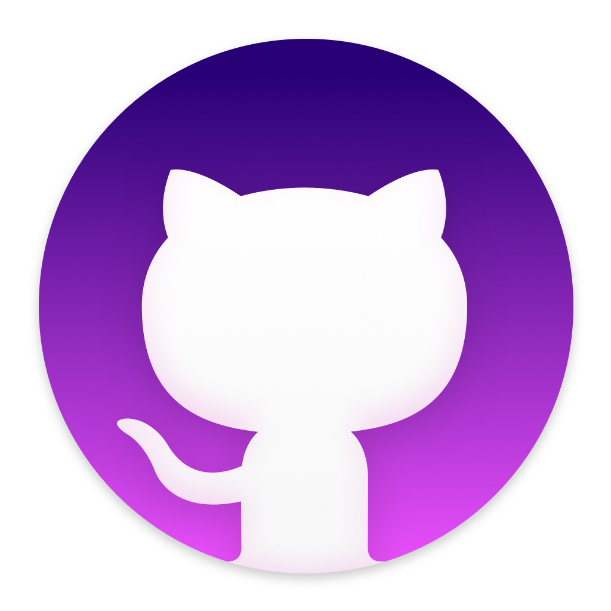
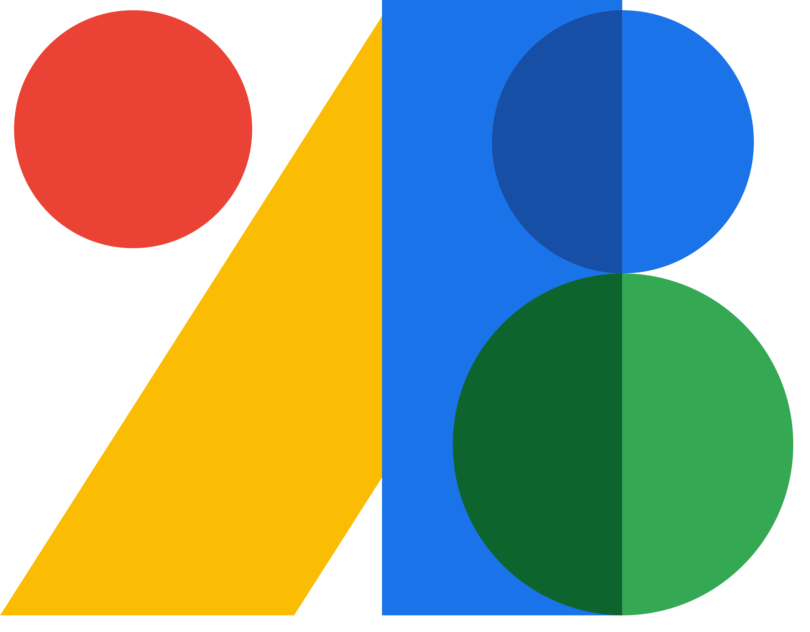
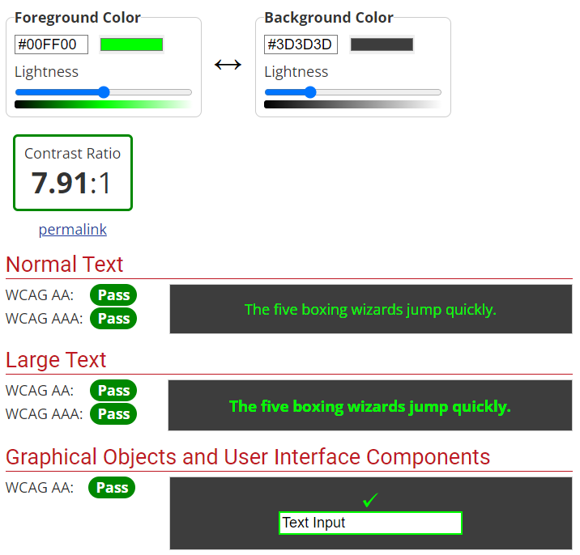
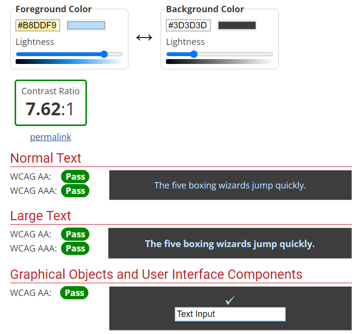

# Project-NTV

NTV-Dart-Flutter

<h1>Criteria</h1>
<h2>Turn-in instructions:</h2>

    This assessment must be turned in via Git at github.com
    Each solution must be in a separate file, within the same project.
    Please add pictures of final output.

<h3><strong>Minimum requirements: 80%</strong></h3>
<ol>
  <li>Git commit / Work constancy - 25%</li>
  <li>Program Correctness - 50%</li>
  <li>Readability: 20%</li>
  <li>Documentation: 15%</li>
  <li>Code Elegance: 15%</li>
  <li>Additional requirements: 20%</li>
  <h4>The pass grade for this assignment is 50%</h4>
</ol>

<dl><h5>Additional requirements (20%) - Pick one</h5>
  <dt>Multiscreen application </dt>
  <dd>Add a nice looking Home screen that has a "Start Game" button - maybe summary for the rules of the game, or fun gif / design that gets the user excited to
  play. The game starts with randomly picked word / sentence from a list. To learn
  how to create multiscreen applications, check out BMI Calculator section of the
  Flutter course. It also covers some advanced UI design and code structuring!
</dd>

  <dt>Input custom words / sentences</dt>
  <dd>Update the starting screen to allow the user to start the game by receiving a
  word / sentence randomly selected for him, or, they can input the word / sentence themselves. That would allow the user to input his own challenge for others to attempt.</dd>

  <dt>Change difficulty</dt>
  <dd>Change the rules of hangman, to allow the user to attempt to solve using easy, medium or hard mode. It’s up the the creator to implement those states - but they could include fewer errors allowed, hide some or all of the wrongly guessed characters or randomly remove successfully guessed character so they have to input it again. Dealers choice.</dd>

  <dt>Hints</dt>
  <dd>Allow the user to get a hint of what the word is, at a cost of a failed guess attempt</dd>

  <dt>Other</dt>
  <dd>Anything other that you might think of that would make the game more fun and engaging!</dd>

</dl>
<h1>Wireframes</h1>
<h1>Technologies</h1>
<ol>
    <li>
        <h3>Git</h3>

         
        Why <a href="https://git-scm.com/" target="_blank">Git</a>: 
        Git is a DevOps tool used for source code management. It is a free and open-source version control system used to handle small to very large projects efficiently. Git is used to tracking changes in the source code, enabling multiple developers to work together on non-linear development.
        

    </li>
    <li>
        <h3>Github</h3>

         
        Why <a href="https://github.com/" target="_blank">Github</a>: 
        Well It's used for storing, tracking, and collaborating on software projects. It makes it easy for developers to share code files and collaborate with fellow developers on open-source projects. GitHub also serves as a social networking site where developers can openly network, collaborate, and pitch their work
        

    </li>
    <li>
        <h3>Github-Desktop</h3>

         
        Why <a href="https://desktop.github.com/" target="_blank">Github-Desktop</a>:
         If you're new to Git and GitHub, you may find it easier to use GitHub Desktop than to use Git on the command line. GitHub Desktop has a graphical user interface that simplifies commands and helps you visualize changes. 
        <small><a href="https://desktop.github.com/" target="_blank">Download here</a></small>
        

    </li>
    <li>
        <h3>Dart</h3>

         
        Why <a href="https://dart.dev/" target="_blank">Dart</a>: 
        Being a compiled language, Dart allows developers to discover programming errors during the compilation process.
        Hence, it is considered a type-safe language.
        On the other hand,
        Java is an interpreted language and allows developers to find programming errors during the runtime.
        

    </li>
    <li>
        <h3>Flutter</h3>

         
        Why <a href="https://docs.flutter.dev/" target="_blank">Flutter</a>: Allows developers to build a single codebase and use it for several platforms such as the web, desktop and mobile. This results in quicker app launch and is cost effective. Reduced Development Time: The requirements for Flutter application development are much lower. 
        

    </li>
    <li>
        <h3>Android Studio</h3>

         
        Why <a href="https://developer.android.com/" target="_blank">Android Studio</a>: Android Studio helps you debug and improve the performance of your code, including inline debugging and performance analysis tools. 
        <small><a href="https://developer.android.com/studio" target="_blank">Download here</a></small>
        

    </li>
    <li>
        <h3>Google Fonts</h3>

         
        Why <a href="https://fonts.google.com/" target="_blank">Google Fonts</a>: Google Fonts is a free and widely-used service provided by Google that offers a diverse collection of web fonts that can be easily embedded into websites. 
        What was used for this project <a href="https://fonts.google.com/specimen/Lemon" target="_blank">Lemon</a>.
        

    </li>
    <li>
        <h3>WebAIM</h3>

         
        Why <a href="#" target="_blank">WebAIM</a>: WebAIM's mission is to expand the potential of the web for people with disabilities.  
        We empower individuals and organizations to create and deliver accessible content by providing knowledge, technical skills, tools, organizational leadership strategies, and vision. 
        

        

        
Contrast Screenshots.

        

             
            
        

        

    </li>
    <li>
        <h3>PLACEHOLDER</h3>

         
        Why <a href="#" target="_blank">PLACEHOLDER</a>: PLACEHOLDER TEXT 
        

    </li>
    <li>
        <h3>PLACEHOLDER</h3>

         
        Why <a href="#" target="_blank">PLACEHOLDER</a>: PLACEHOLDER TEXT 
        

    </li>
    <li>
        <h3>PLACEHOLDER</h3>

         
        Why <a href="#" target="_blank">PLACEHOLDER</a>: PLACEHOLDER TEXT 
        

    </li>
</ol>
<h1>Special Thanks & Acknowledgements</h1>
<table>
<tr>
    <th>Hjalti Agustsson 
        
    </th>
</tr>
<tr>
    <th>Gunnar Geir Helgason
        
    </th>
</tr>
</table>

